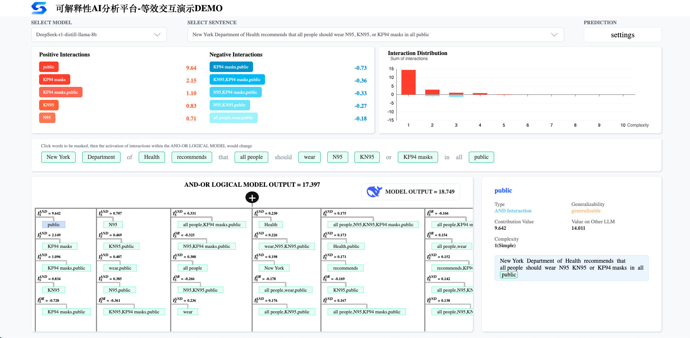

<h1 align="center">Interaction Explanation</h1>

  <a href="README.md">English</a> | 
  <a href="README_zh.md">中文</a>

  
  
  
  

---

最新的理论研究表明，训练良好的深度神经网络（DNN）可以通过一个稀疏的 AND–OR 逻辑模型进行机理层面的解释。  该符号模型能够在任意遮挡输入配置下复现网络的输出行为。

具体而言，AND–OR 逻辑模型由定义在输入变量子集上的交互结构构成：

- **AND 交互** 表示变量之间的与关系 —— 只有当子集中所有变量同时存在时，该效应才会被激活。  
- **OR 交互** 表示变量之间的或关系 —— 子集中任意变量的出现都可以触发该效应。

在该框架下，仅需少量显著交互即可刻画模型的推理行为。

**Interaction Explanation** 将这一理论框架落地为可操作工具，通过提取、量化与可视化这些交互结构，实现对大语言模型推理过程的结构化机理分析。

---

## 使用方式

### 🌐 在线演示

快速体验交互级机理分析结果的方式之一，是访问我们的在线演示平台。

该 Demo 展示了 `Qwen2.5-7B` 与 `deepseek-r1-distill-llama-8b` 的 AND–OR 逻辑模型解释结果。  你可以查看提取出的交互如何在机理层面解释模型的详细推理过程。  此外，你还可以随机对输入词进行掩码，并比较 AND–OR 逻辑模型输出与原始 LLM 输出之间的差异。

👉 [访问在线 Demo](https://www.symtrustai.com/demo)

👉 想要一个更直观的操作演示？请观看下方平台演示视频。

  

  ▶️ 点击观看演示视频

---

### 💻 本地运行

**小规模模式（1.5B）**  
`deepseek-r1-distill-qwen-1.5b` vs `qwen2.5-1.5b`

运行：

    python ./demo --model_size small

**大规模模式（7B / 8B）— 默认**  
`deepseek-r1-distill-llama-8b` vs `qwen2.5-7b`

运行：

    python ./demo

---

## 安装

### 环境要求

- Python 3.10  
- Conda  
- 支持 CUDA 的 GPU  

### 安装步骤

    conda create -n interaction python=3.10
    conda activate interaction
    cd InteractionExplanationDemo
    pip install -r requirements.txt

---

## 模型配置

模型将自动下载并保存至：

    ./model_path

你可以在以下文件中修改默认模型路径：

    ./global_const

如果你已经从 Hugging Face 下载模型，请将其放置在：

    ./model_path/hub/

**框架将自动从该路径检测并加载模型。**

---

## 命令行参数

| 参数 | 默认值 | 说明 |
|----------|----------|-------------|
| `--gpu_id` | 1 | GPU 设备编号 |
| `--cal_batch_size` | 128 | 掩码前向计算批大小 |
| `--model_size` | large | small 或 large |

如显存不足，请适当降低 `--cal_batch_size`。

---

## 自定义输入（进阶）

<b>点击展开配置说明</b>

### 步骤 1 —— 删除默认示例

    rm datasets/custom-generation-test/sentences.txt
    rm -rf players/custom-generation-test/players-qwen-manual/*

### 步骤 2 —— 添加句子

保存至：

    datasets/custom-generation-test/sentences.txt

要求：

- 10–20 个单词  
- 不可重复  
- 具有语义信息  

### 步骤 3 —— 定义 Player

创建：

    players/custom-generation-test/player_words.json

要求：

- 8–15 个 player  
- 顺序必须与原句一致  
- 避免纯标点符号  
- 避免语义弱词（如 and、to、the 等）

---

## 输出内容

每个模型将生成：

- generation.txt  
- inference.txt  
- interaction.txt  
- sparsity.png  
- interaction_tree.pdf  

跨模型对比结果存储于： `generalizable_interaction/`

---

## 硬件建议

| 模式 | 推荐显存 |
|------|------------------|
| small | > 10GB |
| large | > 32GB |

---

## 许可证

Apache License 2.0

